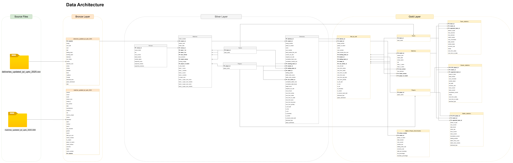

# Cricket Data Analysis
This project aims to use open-source CSV files of ball-by-ball cricket data from the Indian Premier League between 2008 and 2025 and create a data warehouse to develop SQL views that can be used for data analysis.
The end goal is to have a dashboard on either Tableau or PowerBI to visualize the data extracted from the data warehouse. I also want this project to open complex analysis that looks beyond basic analytics and focuses on match situations to create complex analytics.

## Data Engineering approach
I am using the medallion approach to create my data warehouse. The idea is to separate the ETL process into separate stages:
- Bronze Layer: Focus on extracting the data only
- Silver Layer: Focus on transforming and enriching the data
- Gold Layer: Prepare the data to load into the data warehouse and use for analytics

Below is a data flow diagram showcasing how I envision my layers to operate:

### Source Files
I am using the CSV files from this dataset in Kaggle: https://www.kaggle.com/datasets/dgsports/ipl-ball-by-ball-2008-to-2022, which has updated its CSVs for data upto 2025.

This contains 2 CSV files:
- deliveries_updated_ipl_upto_2025.csv: Ball-by-ball information on IPL matches till 2025
- matches_updated_ipl_upto_2025.csv: General match summaries on IPL matches till 2025

### Bronze Layer
This layer will focus on just extracting the CSV information and loading it into Microsoft SQL Server. The schemas will and data content will remain unchanged.

### Silver Layer
This layer will focus on inspecting the data quality of the source file and resolving any data quality issues. We will also enrich the data and prepare the information to be used in the Gold Layer. This is why in the silver layer, I have chosen to split our two tables into the key tables we need for business insights. This allows us to complete complex calculations in this layer, improving the performance of the Gold layer.

The data quality tests will be a stored procedure, which will execute the test plan and ensure that the data has no quality issues in the gold layer.

#### Why have I split the data into these tables?
My main goal is to provide data analytics flexibility in the future by providing an easy-to-read table with all the information you need for data analysis. I have plans to create the following tables:
- Venues: This provides information about each stadium, allowing us to evaluate player and team performance in each stadium. For example, a batting strike rate of 130 might be elite in one stadium but below par in another.
- Matches: A high-level overview of what happened in the match, and adding specific super over details for analysis.
- Teams: To provide each team with a unique Team ID. This also allows us to handle team name changes effectively. For example, the Deccan Chargers are now called Sunrisers Hyderabad, but they are the same team, and stats for the Deccan Chargers should carry over to Sunrisers Hyderabad.
- Players: To provide a unique ID to each player. This makes it easier to keep track of each player and which teams they have played for
- Deliveries: Enriched ball-by-ball information for data analysis, adding information such as CRR, RRR, and data analytics metrics, such as whether the previous ball was a boundary, the score when the batter entered the field, and their batting position.

### Gold Layer
This layer will focus on converting the tables in Silver layers into views. I am using views since this provides flexibility in adding and removing fields without having to change the schema of a table. This also provides future compatibility, allowing me to change the schemas in the silver layer without impacting the end user who will be interacting with the information in the gold layer.

The goal layer has the following views:
- Teams: To provide each team with a unique Team ID.
- Players: To provide each player with a unique Player ID.
- Ball-by-Ball: Ball-by-ball information
- Matches: Match overview information
- Batter-statistics: Create statistics on how each batter performed in each match
- Bowler-statistics: Create statistics on how each bowler performed in each match
- Match-Phases: To evaluate how each player performs in different phases of play: Powerplay, Middle Overs, and Death Overs
