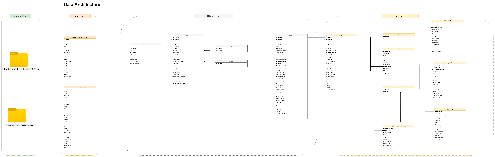

# Cricket Data Analysis
This project aims to use open-source CSV files of ball-by-ball cricket data from the Indian Premier League between 2008 and 2025 and create a data warehouse to develop SQL views that can be used for data analysis.
The end goal is to have a dashboard on either Tableau or PowerBI to visualize the data extracted from the data warehouse. I also want this project to open complex analysis that looks beyond basic analytics and focuses on match situations to create complex analytics.

## Data Engineering approach
I am using the medallion approach to create my data warehouse. The idea is to separate the ETL process into separate stages:
- Bronze Layer: Focus on extracting the data only
- Silver Layer: Focus on transforming and enriching the data
- Gold Layer: Prepare the data to load into the data warehouse and use for analytics

Below is a data flow diagram showcasing how I envision my layers to operate:

### Source Files
I am using the CSV files from this dataset in Kaggle: https://www.kaggle.com/datasets/dgsports/ipl-ball-by-ball-2008-to-2022, which has updated its CSVs for data upto 2025.

This contains 2 CSV files:
- deliveries_updated_ipl_upto_2025.csv: Ball-by-ball information on IPL matches till 2025
- matches_updated_ipl_upto_2025.csv: General match summaries on IPL matches till 2025

### Bronze Layer
This layer will focus on just extracting the CSV information and loading it into Microsoft SQL Server. The schemas will and data content will remain unchanged.

### Silver Layer
This layer will focus on inspecting the data quality of the source file and resolving any data quality issues. We will also enrich the data and prepare the information to be used in the Gold Layer. This is why in the silver layer, I have chosen to split our two tables into the key tables we need for business insights. This allows us to complete complex calculations in this layer, improving the performance of the Gold layer.

The data quality tests will be a stored procedure, which will execute the test plan and ensure that the data has no quality issues in the gold layer.

#### Why have I split the data into these tables?
My main goal is to provide data analytics flexibility in the future by providing an easy-to-read table with all the information you need for data analysis. I have plans to create the following tables:
- Venues: This provides information about each stadium, allowing us to evaluate player and team performance in each stadium. For example, a batting strike rate of 130 might be elite in one stadium but below par in another.
- Matches: A high-level overview of what happened in the match, and adding specific super over details for analysis.
- Teams: To provide each team with a unique Team ID. This also allows us to handle team name changes effectively. For example, the Deccan Chargers are now called Sunrisers Hyderabad, but they are the same team, and stats for the Deccan Chargers should carry over to Sunrisers Hyderabad.
- Players: To provide a unique ID to each player. This makes it easier to keep track of each player and which teams they have played for
- Deliveries: Enriched ball-by-ball information for data analysis, adding information such as CRR, RRR, and data analytics metrics, such as whether the previous ball was a boundary, the score when the batter entered the field, and their batting position.

### Gold Layer
My original plan was to use views, but with window functions, this resulted in an extremely long time for data selection. Thus, I will now create tables instead.

The goal layer has the following tables:
- Teams: To provide each team with a unique Team ID.
- Players: To provide each player with a unique Player ID.
- Venues: To provide each venue with a unique Venue ID.
- Ball-by-Ball: Ball-by-ball information
- Matches: Match overview information
- Batter-statistics: Create statistics on how each batter performed in each over of each match
- Bowler-statistics: Create statistics on how each bowler performed in each over of each match
- Match-Benchmarks: Calculate the average for each over in a particular IPL season, and how a batter or bowler performs.
The gold layer has the following views:
- Match-Impact-Leaderboard: This aims to calculate the impact a player had on the match.

## Test Plan
Below is the test plan I will execute after loading my data into the silver layer, before I proceed to the gold layer. This will ensure data cleansing has been completed successfully and avoid any issues in the future for data analysis.

| Test ID | Test Table | Column Being Tested | Test Description | Expected Outcome | Test Category |
| :--- | :--- | :--- | :--- | :--- | :--- |
| TM-01 | silver.teams | team_id, team_name | Verify composite primary key uniqueness. | 0 duplicate combinations of team_id + team_name. | Uniqueness |
| TM-02 | silver.teams | team_name | Ensure completeness of team names. | 0 rows with NULL or empty team_name. | Completeness |
| TM-03 | silver.teams | team_id | Verify hardcoded mapping logic for franchises. | "Delhi Capitals" and "Delhi Daredevils" both strictly return team_id = 2. | Business Logic |
| PL-01 | silver.players | player_id | Verify primary key uniqueness. | 0 duplicate player_id values. | Uniqueness |
| PL-02 | silver.players | player_name | Ensure completeness of extracted player names. | 0 rows with NULL or empty string player_name. | Completeness |
| VL-01 | silver.venues_lookup | lookup_id | Verify primary key uniqueness. | 0 duplicate lookup_id values. | Uniqueness |
| VL-02 | silver.venues_lookup | new_venue_name | Verify legacy stadium name standardization. | Legacy names (e.g., '%Feroz Shah Kotla%') output strictly as their mapped new_venue_name. | Business Logic |
| VL-03 | silver.venues_lookup | venue_name | Verify deduplication ROW_NUMBER() logic. | 0 duplicate raw venue_name entries. | Uniqueness |
| VN-01 | silver.venues | venue_id | Verify primary key uniqueness. | 0 duplicate venue_id values. | Uniqueness |
| VN-02 | silver.venues | venue_city | Ensure no venues slipped through without a city assigned. | 0 rows with NULL venue_city. | Completeness |
| MA-01 | silver.matches | match_id | Verify granularity / Primary Key uniqueness. | 0 duplicate match_id values. | Uniqueness |
| MA-02 | silver.matches | Row Count | Reconciliation: Compare row count to Bronze layer. | Total rows in silver.matches strictly equals total rows in bronze.matches | Volume / Reconciliation |
| MA-03 | silver.matches | venue_id, team_1_id, team_2_id | Verify foreign key relationships to dimensions. | 0 rows with IDs that do not exist in their respective dimension tables. | Referential Integrity |
| MA-04 | silver.matches | match_winner | The Rain Rule: Validate match winner handling. | If winning_margin IS NULL, match_winner MUST exactly equal 0. | Business Logic |
| MA-05 | silver.matches | winning_margin | Verify concatenation logic. | String must end in ' runs', ' wickets', or be exactly NULL. | Business Logic |
| MA-06 | silver.matches | is_dls_match | Validate DLS boolean generation. | Must strictly equal 1 if Bronze method was 'D/L', else 0. | Domain / Range |
| MA-07 | silver.matches | team_1_score, team_2_score | Cross-Check: Verify match aggregate scores against deliveries. | team_1_score strictly equals MAX(cumulative_team_runs) for inning 1 in silver.deliveries. | Cross-Column Consistency |
| MA-08 | silver.matches | team_1_super_over_score | Verify aggregate sum logic for Super Overs. | Total strictly equals sum of team 1 runs where inning_number > 2. | Business Logic |
| DE-01 | silver.deliveries | delivery_id | Verify composite sorting generated a unique delivery key. | 0 duplicate delivery_id values. | Uniqueness |
| DE-02 | silver.deliveries | Row Count | Reconciliation: Compare row count to Bronze layer. | Total rows in silver.deliveries strictly equals total rows in bronze.deliveries. | Volume / Reconciliation |
| DE-03 | silver.deliveries | match_id | Verify linkage to Match parent table. | Every match_id must exist in silver.matches. | Referential Integrity |
| DE-04 | silver.deliveries | batter_id, bowler_id | Verify linkage to Player dimension. | All populated IDs MUST exist in silver.players. | Referential Integrity |
| DE-05 | silver.deliveries | Boolean Flags (is_dot_ball, is_four, is_six, etc.) | Validate boolean domain ranges. | All boolean flag columns MUST contain strictly 1 or 0 (no NULLs or other ints). | Domain / Range |
| DE-06 | silver.deliveries | over_number | Validate cricket domain boundaries for overs. | Values MUST be between 0 and 19 (for standard innings). | Domain / Range |
| DE-07 | silver.deliveries | cumulative_wickets_lost | Validate cricket domain boundaries for wickets. | Values MUST be between 0 and 10, and strictly non-decreasing within an inning. | Domain / Range |
| DE-08 | silver.deliveries | is_boundary | Validate Cross-Column consistency for boundaries. | is_boundary = 1 ONLY IF (is_four = 1 OR is_six = 1). | Cross-Column Consistency |
| DE-09 | silver.deliveries | is_dot_ball | Validate batter's perspective dot ball logic. | is_dot_ball = 1 ONLY when runs_off_bat = 0 AND runs_off_wides = 0. | Business Logic |
| DE-10 | silver.deliveries | is_bounce_back_ball | Validate previous-ball window function (LAG). | Equals 1 ONLY if the preceding ball in the partition was a boundary (runs >= 4). | Business Logic |
| DE-11 | silver.deliveries | phase_of_match | Validate powerplay/middle/death bucketing. | Over < 6 = 'powerplay'; Over 6-14 = 'middle_overs'; Over > 14 = 'death_overs'. | Business Logic |
| DE-12 | silver.deliveries | required_run_rate | Validate RRR constraints (NULLing rules). | Strictly NULL for inning_number = 1 OR if is_dls_match = 'YES'. | Business Logic |
| DE-13 | silver.deliveries | balls_bowled_this_over | Verify the "10th ball" anomaly fix logic. | Values should correctly reflect the ball_instance_rank modification. | Business Logic |
| DE-14 | silver.deliveries | batter_entry_score | Validate entry score tracking via FIRST_VALUE. | Score must equal cumulative_team_runs minus runs off the current ball. | Business Logic |
